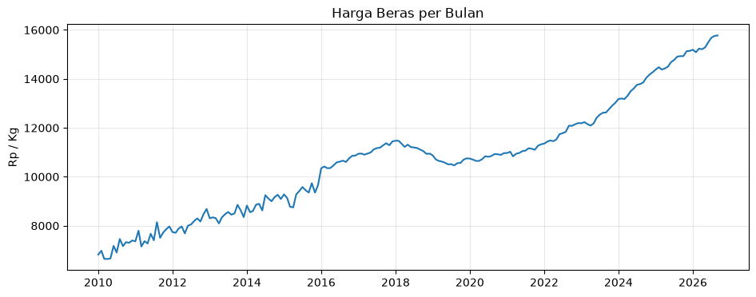
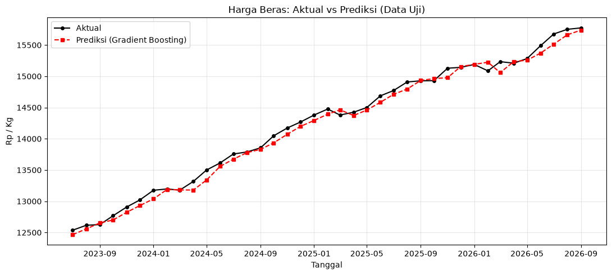
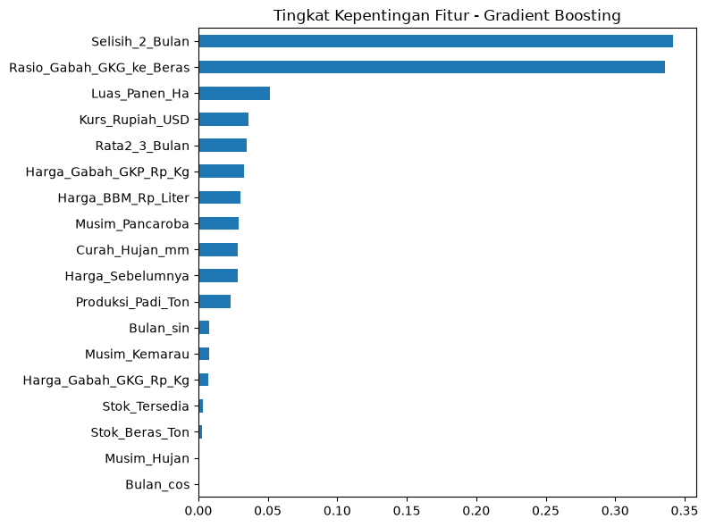

# 🌾 Prediksi Harga Beras Indonesia dengan Machine Learning

Perbandingan **Ridge Regression**, **Random Forest**, dan **Gradient Boosting** untuk memprediksi harga beras bulan berikutnya (Rp/kg) menggunakan data bulanan 2010–2026.


---

## 📑 Daftar Isi

1. [Latar Belakang Permasalahan](#-latar-belakang-permasalahan)
2. [Kumpulan Data](#-kumpulan-data)
3. [Metodologi](#-metodologi)
4. [Hasil](#-hasil)
5. [Kesimpulan dan Keterbatasan](#-kesimpulan-dan-keterbatasan)
6. [Struktur Repositori](#-struktur-repositori)
7. [Cara Menjalankan](#-cara-menjalankan)

---

## 🎯 Latar Belakang Permasalahan

Beras adalah bahan pangan pokok masyarakat Indonesia. Harganya memiliki **tren naik** dari tahun ke tahun dan dipengaruhi banyak faktor sekaligus, seperti harga gabah, produksi padi, kurs, harga BBM, cuaca, dan musim. Kombinasi faktor tersebut membuat harga beras sulit ditebak secara manual.

**Tujuan proyek:** membangun model machine learning untuk memprediksi **harga beras bulan berikutnya (Rp/kg)**.

**Tolok ukur keberhasilan:** model harus lebih baik daripada *baseline* sederhana, yaitu asumsi bahwa **harga bulan ini = harga bulan lalu**. Jika model tidak mampu mengalahkan baseline ini, maka model tersebut tidak memberi nilai tambah.



*Gambar 1. Tren harga beras per bulan, 2010–2026.*

---

## 📊 Kumpulan Data

| Keterangan | Nilai |
|---|---|
| Berkas | `Dataset_Harga_Beras_Beberapa_Tahun_Lalu.csv` |
| Frekuensi | Bulanan |
| Rentang waktu | Januari 2010 – September 2026 |
| Jumlah baris | 201 |
| Jumlah kolom awal | 15 |
| Nilai kosong (*missing*) | Tidak ada |
| Variabel target | `Harga_Beras_Rp_Kg` |

### Deskripsi Kolom

| Kolom | Deskripsi | Satuan |
|---|---|---|
| `Tanggal` | Tanggal data (awal bulan) | YYYY-MM-DD |
| `Tahun` | Tahun pengamatan | – |
| `Bulan` | Bulan pengamatan (angka) | 1–12 |
| `Nama_Bulan` | Nama bulan | – |
| `Musim` | Kategori musim: Hujan, Pancaroba, Kemarau | – |
| `Curah_Hujan_mm` | Curah hujan | mm |
| `Luas_Panen_Ha` | Luas panen padi | Ha |
| `Produksi_Padi_Ton` | Produksi padi | Ton |
| `Harga_Gabah_GKP_Rp_Kg` | Harga Gabah Kering Panen | Rp/kg |
| `Harga_Gabah_GKG_Rp_Kg` | Harga Gabah Kering Giling | Rp/kg |
| `Stok_Beras_Ton` | Stok beras | Ton |
| `Harga_BBM_Rp_Liter` | Harga BBM | Rp/liter |
| `Kurs_Rupiah_USD` | Kurs Rupiah terhadap USD | Rp/USD |
| `Harga_Beras_Bulan_Sebelumnya_Rp_Kg` | Harga beras bulan sebelumnya | Rp/kg |
| `Harga_Beras_Rp_Kg` | **Harga beras bulan ini (target)** | Rp/kg |

### Ringkasan Statistik

| Variabel | Min | Rata-rata | Maks |
|---|---:|---:|---:|
| Harga beras (Rp/kg) | 6.641 | 10.686 | 15.774 |
| Harga gabah GKP (Rp/kg) | 3.624 | 5.116 | 7.048 |
| Harga gabah GKG (Rp/kg) | 3.892 | 5.579 | 7.758 |
| Harga BBM (Rp/liter) | 3.915 | 7.203 | 10.030 |
| Kurs (Rp/USD) | 10.602 | 13.809 | 17.966 |
| Curah hujan (mm) | 45 | 172 | 338 |

### Catatan Kualitas Data

- **Nilai stok = 1 pada 64 baris (2010–2015)** dianggap sebagai *placeholder* (data sebenarnya tidak tersedia), bukan stok riil. Nilai ini ditangani pada tahap pembersihan data (lihat [Metodologi](#-metodologi)).
- Pada eksplorasi data, harga gabah, kurs, dan BBM memiliki korelasi tinggi (**0,95–0,97**) dengan harga beras.

---

## 🔬 Metodologi

Alur kerja proyek terdiri dari empat tahap utama:

```
Data & Pembersihan → Feature Engineering → Split Berdasarkan Waktu → Tuning Model → Evaluasi
```

### 1. Data dan Pembersihan

Nilai stok beras = 1 pada 2010–2015 dianggap *placeholder*, sehingga diubah menjadi `0` dan ditandai dengan fitur biner **`Stok_Tersedia`** agar model dapat membedakan data stok yang valid dan yang tidak tersedia.

### 2. Feature Engineering

Total **18 fitur** yang digunakan model, di antaranya:

- **Bulan siklis** (transformasi `sin` dan `cos`) agar Desember dan Januari dipahami sebagai bulan yang berdekatan.
- **Musim** dengan *one-hot encoding*.
- **Selisih harga 2 bulan** (momentum harga).
- **Rata-rata bergerak 3 bulan**.
- **Rasio harga gabah GKG terhadap harga beras**.

### 3. Split Data Berdasarkan Waktu

| Set | Jumlah baris | Periode |
|---|---:|---|
| Latih (*train*) | 159 | 2010 – 2023 |
| Uji (*test*) | 39 | Juli 2023 – September 2026 |

Data **tidak diacak** (*no shuffle*) untuk menghindari kebocoran data (*data leakage*) dari masa depan ke masa lalu. Jumlah baris berkurang dari 201 menjadi 198 karena beberapa baris awal hilang saat pembuatan fitur selisih dan rata-rata bergerak.

### 4. Target: Log-Return

Model **tidak memprediksi harga secara langsung**, melainkan **log-return** (perubahan harga terhadap bulan lalu), lalu hasilnya dikonversi kembali ke Rupiah.

> **Mengapa?** Model berbasis pohon (Random Forest dan Gradient Boosting) tidak dapat memprediksi di luar rentang nilai data latih. Karena harga beras terus naik, harga di masa uji dapat melampaui harga tertinggi pada data latih. Dengan memprediksi perubahan relatif, masalah ini dapat dihindari.

### 5. Tuning dan Model yang Dibandingkan

| Model | Keterangan |
|---|---|
| **Baseline** | Harga bulan ini = harga bulan lalu |
| **Ridge Regression** | Model linear dengan regularisasi L2 |
| **Random Forest** | *Ensemble* pohon keputusan (bagging) |
| **Gradient Boosting** | *Ensemble* pohon keputusan (boosting) |

- Metode tuning: **`GridSearchCV`** dengan **`TimeSeriesSplit`** (5 lipatan)
- Metrik penilaian: **MAE** (*Mean Absolute Error*)
- Metrik evaluasi: **MAE**, **MAPE**, dan **R²**

---

## 🏆 Hasil

### Perbandingan Model pada Data Uji

| Model | MAE (Rp/kg) |
|---|---:|
| Baseline | 98,56 |
| Ridge Regression | 88,46 |
| Random Forest | 79,98 |
| **Gradient Boosting** ⭐ | **74,44** |

Semakin kecil MAE, semakin baik model.

### Model Terbaik: Gradient Boosting

| Metrik | Nilai |
|---|---|
| MAE | **Rp 74,44 / kg** |
| MAPE | **0,52%** |
| Perbaikan MAE terhadap baseline | **24,5%** lebih rendah (74,44 vs 98,56) |

**Parameter terbaik:**

| Parameter | Nilai |
|---|---|
| `learning_rate` | 0,03 |
| `max_depth` | 2 |
| `n_estimators` | 100 |

> **Catatan:** R² bernilai sama-sama 0,99 pada baseline dan model, karena harga beras sangat bergantung pada harga bulan sebelumnya. Karena itu **MAE dan MAPE lebih informatif** untuk membandingkan model.

### Prediksi vs Harga Aktual



*Gambar 2. Prediksi model mengikuti pola harga aktual pada data uji (Juli 2023 – September 2026, 39 bulan).*

### Fitur yang Paling Berpengaruh



*Gambar 3. Tingkat kepentingan fitur pada model Gradient Boosting.*

- **Selisih harga 2 bulan** dan **rasio gabah GKG terhadap beras** dominan, masing-masing sekitar **0,34**.
- **Momentum harga** dan **hubungan harga gabah–beras** lebih menentukan daripada faktor cuaca dan musim.

### Contoh Prediksi

Prediksi harga beras **Oktober 2026**: **± Rp 15.833 / kg** (berdasarkan nilai input contoh pada notebook).

---

## ✅ Kesimpulan dan Keterbatasan

**Kesimpulan**

- **Gradient Boosting** menjadi model terbaik dengan MAE Rp 74 dan MAPE 0,52%, mengalahkan baseline dan dua model lainnya.
- Penggunaan **target log-return** dan **split berdasarkan waktu** membuat evaluasi lebih realistis.

**Keterbatasan**

- Data stok beras 2010–2015 perlu **diverifikasi ke sumber asli**.
- Prediksi bulan depan **bergantung pada nilai input** yang dimasukkan pengguna.
- Data uji relatif kecil (39 bulan), sehingga hasil sebaiknya dievaluasi ulang ketika data baru tersedia.

---

## 📁 Struktur Repositori

> Sesuaikan dengan isi repositori Anda.

```
.
├── README.md
├── Dataset_Harga_Beras_Beberapa_Tahun_Lalu.csv   # Dataset
├── notebook.ipynb                                # Notebook analisis dan pemodelan
├── PPT_ML_PrediksiHargaBeras.pptx                # Slide presentasi
├── requirements.txt                              # Daftar dependensi
└── img/
    ├── tren.png
    ├── aktual.png
    └── fitur.png
```

---

## ⚙️ Cara Menjalankan

```bash
# 1. Clone repositori
git clone https://github.com/<username>/<nama-repositori>.git
cd <nama-repositori>

# 2. (Opsional) Buat virtual environment
python -m venv venv
source venv/bin/activate        # Windows: venv\Scripts\activate

# 3. Instal dependensi
pip install pandas numpy scikit-learn matplotlib jupyter

# 4. Jalankan notebook
jupyter notebook notebook.ipynb
```

---

## 👤 Penulis

**<Ainul Yakin>** — [GitHub](https://github.com/<akinnn-ay>) · [LinkedIn](https://linkedin.com/in/<username>)

## 📄 Lisensi

Proyek ini dirilis di bawah lisensi [MIT](LICENSE). *(Ganti sesuai kebutuhan.)*
